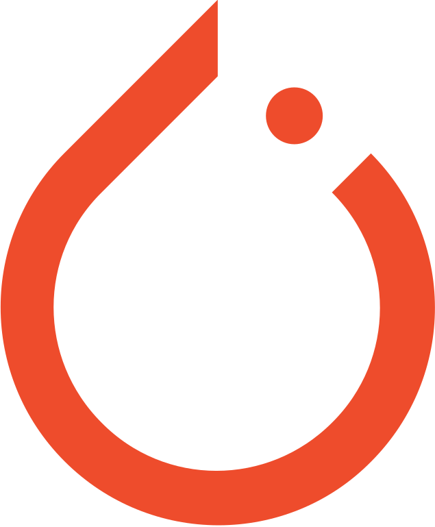

  

<h3 align='center'>
  Welcome to my profile
</h3>
 
#  About me
- My name is Eduardo Rodrigues de Farias.
- I live in Brazil. 
- I'm studying Software engineering since 2019 at Brasilia's University (UNB). 
- I'm a very enthusiastic programmer and my goal is to work with fullstack software development.
- I'm currently a member of the [PanGeiaUnB ](https://github.com/PanGeiaUnB) study group. 
- I'm currently working at a junior company called [EngNet Consultoria ](https://engnetconsultoria.com.br/).
- I usually work with debian based linux, but I surely am a Windows fan. 

### 

### 

#  My skills

-  Pytorch
-  Jupyter Notebook
-  Typescript
-  React
-  Django Rest
-  Mongo DB
-  Docker
-  C/C++ Basics
-  Java Basics
-  Agile software development
-  VSCode
-  Linux

#  My Stats

  
  

GitHub Stats by anuraghazra: [GitHub Repo](https://github.com/anuraghazra/github-readme-stats)
